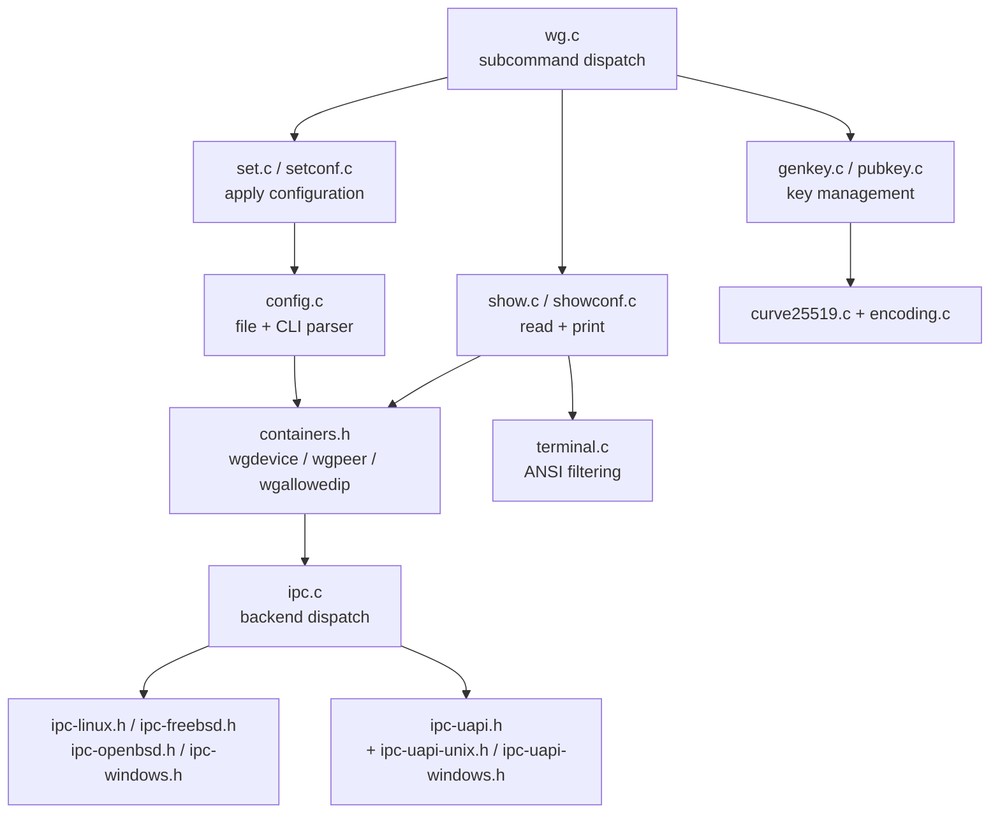
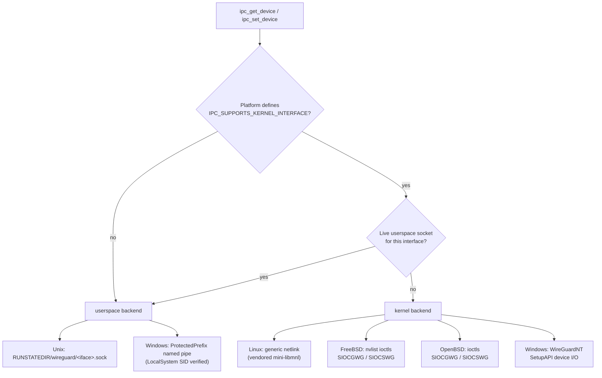
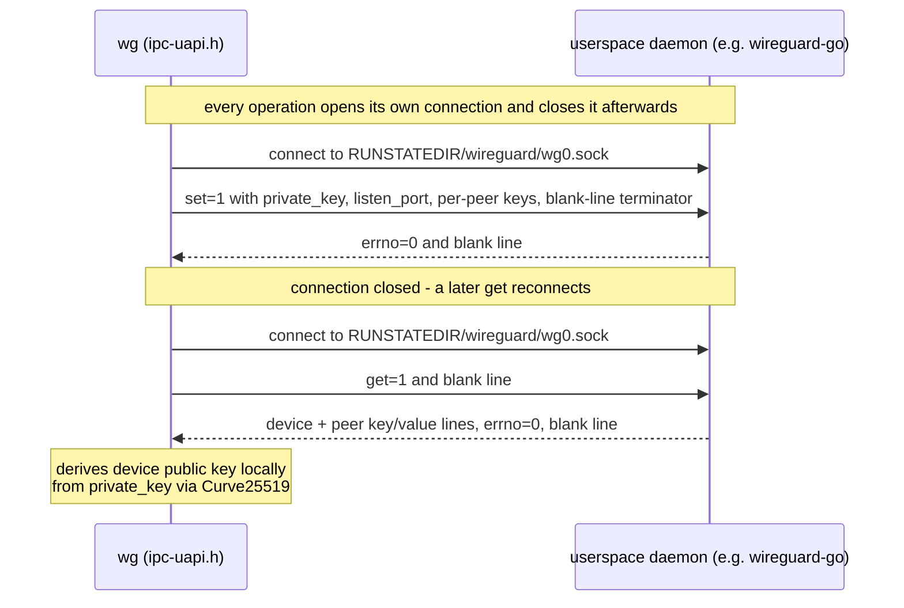
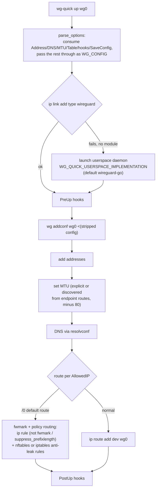

# wireguard-tools — Architecture

`wg(8)` is a short-lived, **single-threaded** CLI process: parse input → build an in-memory
device model → exchange it with the implementation that owns the interface → print results →
exit. `wg-quick(8)` is an orchestration script that drives `wg` plus the OS network stack.
This document describes both, their portability boundaries, and the trust/safety posture.
Companion document: `docs/PROJECT.md` (what the project is, commands, roadmap).

## 1. Component Overview

- `wg.c` maps the nine subcommands onto six entry points (`addconf`/`syncconf` reuse
  `setconf_main`; `genpsk` reuses `genkey_main`) and defaults bare `wg` to `show`.
- All configuration state flows through one model: `struct wgdevice` → linked `struct wgpeer`
  → linked `struct wgallowedip`, with `WGDEVICE_*`/`WGPEER_*`/`WGALLOWEDIP_*` flag bits
  recording which fields are present (`HAS_*`) and which semantics apply
  (`WGDEVICE_REPLACE_PEERS`, `WGPEER_REPLACE_ALLOWEDIPS`, `WGPEER_REMOVE_ME`,
  `WGALLOWEDIP_REMOVE_ME`). `free_wgdevice()` releases the whole graph.

## 2. Configuration Model

`config.c` implements two front-ends over the same model:

- **File parser** (`config_read_init` → `config_read_line` per line → `config_read_finish`):
  strips whitespace and `#` comments, tracks the current INI section, and dispatches
  case-insensitive `Key=` matches — `[Interface]`: `ListenPort`, `FwMark`, `PrivateKey`;
  `[Peer]`: `Endpoint`, `PublicKey`, `AllowedIPs`, `PersistentKeepalive`, `PresharedKey`.
  Unknown lines are hard errors. `config_read_finish` rejects peers without a public key.
- **CLI grammar parser** (`config_read_cmd`) for `wg set`: positional word pairs
  (`listen-port`, `fwmark`, `private-key <file>`, `peer <key>`, `endpoint`,
  `allowed-ips`, `persistent-keepalive`, `preshared-key <file>`) plus the bare `remove`
  flag on a peer. Private and preshared keys
  arrive as **files** here (the peer public key is inline) so private material never sits in
  `argv`.

Parsing details that matter:

- `Endpoint` accepts `host:port` and `[v6]:port`, resolved via `getaddrinfo` with a retry
  loop (default 15 retries, `WG_ENDPOINT_RESOLUTION_RETRIES`, `infinity` supported;
  permanent DNS failures abort immediately). The result is stored as a raw
  `sockaddr_in`/`sockaddr_in6` union in the peer — the model has no textual endpoint today
  (the WebSocket roadmap item extends exactly this point).
- `AllowedIPs` defaults to replace-all semantics; a `+`/`-` prefix on an entry switches the
  whole peer to incremental mode (`-` additionally flags `WGALLOWEDIP_REMOVE_ME`), and a
  nonzero host part only warns.
- `setconf` vs `addconf` differ only in the initial flag set (`REPLACE_PEERS` plus
  has-private-key/fwmark/listen-port defaults). `syncconf` first reads the runtime config and
  computes a minimal diff: peers present at runtime but absent from the file get
  `WGPEER_REMOVE_ME` entries; cleared preshared keys and keepalives are explicitly zeroed.

## 3. IPC Backend Selection

- `ipc.c` selects per call: **a live userspace socket always wins** over a kernel interface
  of the same name; `ipc_list_devices` merges both enumerations.
- The userspace path probes by `stat`+`connect`; a refused connection deletes the stale
  socket. On Windows, the pipe owner must be the LocalSystem SID before it is trusted.
- The Linux backend vendors a minimized libmnl (`netlink.h`, LGPL-2.1+) and handles large
  device dumps (`SOCKET_BUFFER_SIZE`, multi-message peers/allowed-ips continuation). Kernel
  UAPI headers have per-OS fallback copies under `src/uapi/`.

## 4. UAPI Text Protocol (userspace implementations)

Keys are hex on the wire (base64 in config files and display). `wg` validates every response
line, bounds every number (`NUM(max)` macro), and treats protocol violations as `-EPROTO`.
The device public key is never sent by the daemon — `wg` derives it from the returned private
key. This protocol is the compatibility contract with `wireguard-go` and every other
userspace implementation; the WebSocket keys below are **additive** and coordinated with the
sibling `wireguard-go` fork (≥ 1.3.0).

### 4a. WebSocket/wstunnel transport surface

The sibling `wireguard-go` fork (≥ 1.3.0) carries WireGuard over a WebSocket/wstunnel connection
using a **UDP-parity** UAPI: `endpoint=` is a plain resolved `ip:port` for **every** transport,
and the carrier is chosen by a mandatory per-peer `transport=` key. `wg` maps its CamelCase
config-file/CLI keys onto these UAPI keys:

| Config (`[Peer]`) | UAPI | Notes |
|---|---|---|
| `Endpoint = ws(s)://host:port/path` | `endpoint=ip:port` **+** `ws_url=<URL>` | host resolved host-side via the same resolver as UDP (IPv6 re-bracketed) |
| `WSMode = websocket\|wstunnel` | `transport=` | inferred; `udp` when the `Endpoint` has no `ws(s)://` scheme |
| `WSTunnelTarget` | `wstunnel_target` | verbatim `host:port`; required for `wstunnel`, rejected otherwise |
| `WSBearer` (secret) | `ws_bearer` | CLI reads it from a file so it never sits in `argv` |
| `WSMask`, `WSTLSCA/Cert/Key/Insecure`, `WSPingInterval`, `WSBackoffMin/Max` | `ws_mask`, `ws_tls_*`, `ws_ping_interval`, `ws_backoff_min/max` | booleans/ms |

| Config (`[Interface]`) | UAPI / effect |
|---|---|
| `WSListen`, `WSServerTLSCert/Key`, `WSServerBearer` (secret), `WSTrustedProxies` | `ws_listen`, `ws_server_*`, `ws_trusted_proxies` |
| `MetricsListen` | consumed by `wg-quick`, exported as the `WG_METRICS_LISTEN` env var (the only remaining env var) |

`transport=` is emitted for **every created peer** (mandatory at creation), tying the userspace
UAPI path to `wireguard-go` ≥ 1.3.0; the kernel/netlink path never emits it. Device WS keys are
emitted only when configured (their flags are not default-set), so a plain-UDP `setconf` adds no
`ws_*` keys — additive interop is preserved. `ipc.c` rejects a WebSocket config on a kernel
interface with `EOPNOTSUPP`. Secrets (`WSBearer`, `WSServerBearer`) round-trip via `showconf`
(like `PresharedKey`) but are never shown by `show`/`dump`/`endpoints`.

## 5. wg-quick Orchestration (Linux flow)

- `down` reverses: hooks, optional `SaveConfig` re-export (umask 077, write-temp-then-rename),
  policy-rule cleanup and link deletion, then DNS/firewall teardown.
- Platform variants: **darwin** launches the userspace daemon against `utun`, resolves the real
  interface name via `WG_TUN_NAME_FILE`/`/var/run/wireguard/<iface>.name`, manages DNS with
  `networksetup`, and keeps a background `route -n monitor` daemon to re-apply endpoint
  routes, auto-discovered MTU, and DNS on network changes; **freebsd/openbsd** use their `ifconfig`/route
  idioms; **android** is a separate C program (`android.c`) integrating with Android's
  networking. The systemd unit runs `wg-quick up %i` with
  `WG_ENDPOINT_RESOLUTION_RETRIES=infinity`; `ExecReload` uses `wg syncconf` with
  `wg-quick strip`.

## 6. Crypto & Randomness

- **Curve25519 only** — used to derive public keys (`pubkey`, and locally during UAPI `get`)
  and to clamp generated private keys. Two vendored formally-derived backends:
  `curve25519-fiat32.h` and `curve25519-hacl64.h`, selected at compile time by 128-bit
  integer compiler support (`__SIZEOF_INT128__`).
- **Randomness**: `getentropy` (OpenBSD / macOS 10.12+ / glibc ≥ 2.25) → `getrandom` syscall (Linux) →
  `/dev/urandom` read loop; Windows uses `RtlGenRandom`. The POSIX wrapper refuses requests
  larger than 256 bytes (keys are 32); `genkey` warns when stdout is a world-accessible
  regular file.
- **Constant-time helpers**: `encoding.c` (base64/hex, branchless validity accumulation),
  `ctype.h` (locale-independent, constant-time character classes), `key_is_zero`.
  These MUST NOT be replaced with variable-time equivalents.

## 7. Portability Boundaries

| Boundary | Mechanism |
|---|---|
| Kernel config protocol | `ipc-<os>.h` headers, selected by `#if defined(...)` in `ipc.c`; each defines `IPC_SUPPORTS_KERNEL_INTERFACE` plus `kernel_*` functions. |
| Userspace config protocol | `ipc-uapi.h` (shared logic) + `ipc-uapi-unix.h` / `ipc-uapi-windows.h` (socket vs named pipe). |
| Kernel headers | `src/uapi/<os>/` fallback copies, added with `-isystem` when present. |
| Windows libc gaps | `src/wincompat/` (compat header force-included, libc shims, loader, resources); llvm-mingw toolchain, delay-loaded system DLLs. |
| Interface orchestration | One `wg-quick` implementation per platform (`linux.bash`, `darwin.bash`, `freebsd.bash`, `openbsd.bash`, `android.c`); the Makefile installs the one matching `PLATFORM`. |
| Build | Single `src/Makefile`; `PLATFORM` from `uname -s`; per-platform `LDLIBS`/`CFLAGS` branches. |

Rule of thumb enforced across the codebase: **shared logic stays platform-agnostic; platform
divergence lives in dedicated files**, and any change to shared behavior must keep every
platform variant consistent.

## 8. Security Posture

- **Secrets discipline**: `wg show` hides private/preshared keys unless `WG_HIDE_KEYS=never`;
  keys are read from files (not argv) in `wg set`; key files created by `wg-quick save` use
  umask 077 with atomic replace; `genkey` warns on world-accessible stdout; key-length
  failures and `pubkey` stdin errors never echo content, while base64-format failures quote
  the offending value (including key-file contents) like any other parse error; `wg-quick`
  warns when the config file is world-accessible.
- **Input distrust**: every UAPI response byte, config line, and CLI argument is validated
  and bounded; the interface name is checked against path traversal (`/` rejected) before
  socket path construction; Windows verifies pipe ownership before speaking.
- **Anti-leak routing** (`wg-quick` Linux): default-route configs get fwmark-based policy
  routing plus nftables/iptables rules that drop non-local traffic addressed to the
  tunnel's own IPs and preserve connection marks for UDP.
- **Fuzzing surface** (`src/fuzz/`): config-file syntax, `set` grammar, full command
  dispatch, UAPI response parsing, interface-list handling — all under libFuzzer + ASan.

## 9. Process & Concurrency Model

`wg` is strictly single-threaded and short-lived; static buffers in printer helpers
(`show.c`) rely on that and are NOT thread-safe by design. There are no signals handled, no
timers, no event loops. `wg-quick` (darwin) is the only long-lived piece: a backgrounded bash
monitor subshell. Any change that would introduce threads or async signal logic requires
explicit approval per `.claude/rules/c.md`.
