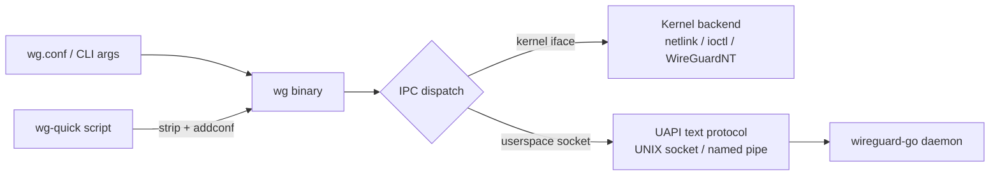

# wireguard-tools — Project

This repo is **wireguard-tools**: the canonical **userspace tooling for configuring
[WireGuard](https://www.wireguard.com/) tunnels**, written in **C** (with bash for `wg-quick`). It
builds the `wg(8)` binary — show, configure, and key-manage WireGuard interfaces — and ships the
`wg-quick(8)` script family, man pages, bash completions, and systemd units. It supports Linux,
macOS, FreeBSD, OpenBSD, Windows, and Android.

> **This build is a fork of upstream `wireguard-tools`** (sibling of the
> [`wireguard-go`](https://github.com/danielealbano/wireguard-go) fork, which adds a WebSocket
> transport in server and client mode). The fork's goals are: (1) a **sanitizer-hardened,
> unit-tested codebase** with CI quality gates; (2) **support for the WebSocket settings**
> introduced by the sibling `wireguard-go` fork, surfaced entirely through the standard
> configuration files; (3) **CI-built release artifacts** for Linux and macOS distributed via
> GitHub releases and a Homebrew tap. See [Roadmap](#roadmap). Licensed GPL-2.0 (`COPYING`).

---

## What It Does

- **`wg(8)`** (`src/*.c`) — the configuration tool. Subcommands: `show`, `showconf`, `set`,
  `setconf`, `addconf`, `syncconf`, `genkey`, `genpsk`, `pubkey`. It parses INI-style
  configuration (files or command-line grammar) into an in-memory device/peer model and applies
  it through a per-platform IPC backend — the kernel implementation where one exists, or any
  userspace implementation (e.g. `wireguard-go`) over the cross-platform UAPI text protocol.
- **`wg-quick(8)`** (`src/wg-quick/*.bash`, one script per platform, plus `android.c`) — an
  opinionated wrapper that reads an extended config file, creates the interface (falling back to
  a userspace implementation when no kernel module is present), applies the `wg` configuration,
  and manages addresses, MTU, DNS, routes (including fwmark-based default-route policy routing
  with nftables/iptables integration on Linux), and up/down hooks.
- **Support surfaces** — man pages (`src/man`), bash completions (`src/completion`), systemd
  units (`src/systemd`), Windows compatibility layer (`src/wincompat`), libFuzzer harnesses
  (`src/fuzz`), and example integrations under `contrib/` (including a single-file embeddable
  C library for configuring WireGuard from your own program, a JSON status dumper, DNS
  re-resolution, and a launchd setup for macOS).

---

## Tech Stack

| Concern | Choice | Notes |
|---|---|---|
| Language | **C** (`-std=gnu99 -D_GNU_SOURCE`) | `-Wall -Wextra`; zero third-party dependencies — libc and system interfaces only. |
| Scripting | **bash** | `wg-quick` per-platform scripts; Android uses a C implementation instead. |
| Build | **GNU make** (`src/Makefile`) | Plain hand-written Makefile; `PLATFORM` auto-detected from `uname -s`. |
| Crypto | in-repo **Curve25519** | `curve25519-fiat32.h` (32-bit) / `curve25519-hacl64.h` (64-bit) backends; used only for public-key derivation and key clamping. |
| Encoding | in-repo base64/hex (`encoding.c`) | Constant-time conversions; constant-time `ctype.h` replacements. |
| Netlink | in-repo **mini-libmnl** (`netlink.h`, LGPL-2.1+) | Vendored, minimized libmnl; no external libmnl dependency. |
| Kernel UAPI headers | `src/uapi/<os>/` | Fallback copies per OS: `linux/wireguard.h`, `dev/wg/if_wg.h`, `net/if_wg.h`, and `wireguard.h` (WireGuardNT). |
| Windows | **llvm-mingw** (`x86_64-w64-mingw32-clang`) | `src/wincompat/` shims, delay-loaded DLLs, Windows ≥ 10. |
| Static analysis | **scan-build** (`make check`) | Clang Static Analyzer over the full build. clang-tidy gate: see [Roadmap](#roadmap). |
| Fuzzing | **libFuzzer + ASan** (`src/fuzz/`) | Six harnesses: `config`, `uapi`, `stringlist`, `cmd`, `set`, `setconf`; clang required. |
| Unit tests | **Unity** (vendored) — planned | Lands with the fork's test-suite pass; see [Roadmap](#roadmap) and `.claude/rules/c.md`. |
| Versioning | `git describe` → `WIREGUARD_TOOLS_VERSION` | Injected by the Makefile; `version.h` fallback for Windows resources. |

---

## Repository Layout

| Path | Contents |
|---|---|
| `src/wg.c`, `src/subcommands.h` | Entry point and subcommand dispatch table. |
| `src/show.c`, `src/showconf.c` | Pretty/scriptable status output; runtime config export. |
| `src/set.c`, `src/setconf.c` | `set` CLI grammar; `setconf`/`addconf`/`syncconf` file application. |
| `src/genkey.c`, `src/pubkey.c` | Key generation (getentropy/getrandom/urandom) and public-key derivation. |
| `src/config.c` / `config.h` | INI config-file and CLI-grammar parser → `wgdevice`/`wgpeer` model. |
| `src/containers.h` | `wgdevice`/`wgpeer`/`wgallowedip` linked-list model + flags. |
| `src/ipc.c` / `ipc.h`, `src/ipc-*.h` | IPC dispatch and per-platform backends (see `docs/ARCHITECTURE.md`). |
| `src/curve25519*`, `src/encoding.*`, `src/ctype.h` | Crypto and constant-time helpers. |
| `src/terminal.c` / `terminal.h` | ANSI color output with tty detection and filtering. |
| `src/wg-quick/` | Per-platform `wg-quick` implementations (`linux`, `darwin`, `freebsd`, `openbsd` bash; `android.c`). |
| `src/man/`, `src/completion/`, `src/systemd/` | Man pages, bash completions, `wg-quick@.service` + target. |
| `src/wincompat/` | Windows libc shims, delay-load loader, resources, manifest. |
| `src/fuzz/` | libFuzzer harnesses (clang, `-fsanitize=fuzzer,address`). |
| `src/uapi/` | Per-OS kernel header fallbacks. |
| `contrib/` | Examples and integrations (embeddable-wg-library, json, reresolve-dns, launchd, highlighter, …). |
| `docs/` | This document, `ARCHITECTURE.md`, and plan documents under `docs/plans/`. |

---

## Configuration & Runtime Surfaces

### Command line

`wg` alone defaults to `wg show`. `wg set` accepts an inline grammar (`listen-port`, `fwmark`,
`private-key <file>`, `peer <key>` with `remove`, `preshared-key <file>`, `endpoint`,
`persistent-keepalive`, `allowed-ips`). `wg setconf|addconf|syncconf <iface> <file>` apply a
config file (replace / append / minimal-diff sync). `genkey`/`genpsk` write a fresh key to
stdout (warning if the destination is world-accessible); `pubkey` derives the public key on a
stdin→stdout pipe.

### Configuration file format

INI-style, parsed case-insensitively, whitespace-stripped, `#` comments:

- **`[Interface]`** — `PrivateKey`, `ListenPort`, `FwMark` (`off`/decimal/`0x` hex).
- **`[Peer]`** — `PublicKey`, `PresharedKey`, `AllowedIPs` (comma-separated CIDRs; a `+`/`-`
  prefix switches to incremental add/remove instead of replace), `Endpoint` (`host:port` or
  `[v6]:port`, DNS-resolved with retries), `PersistentKeepalive` (`off`/1–65535).

`wg-quick` accepts the same file plus its own `[Interface]` keys — `Address`, `DNS` (servers
and search domains), `MTU`, `Table` (`auto`/`off`/table), `PreUp`/`PostUp`/`PreDown`/`PostDown`
(with `%i` interface expansion), `SaveConfig` — which it consumes itself and strips before
handing the remainder to `wg addconf` (`wg-quick strip` exposes the stripped form).

### Environment variables

| Variable | Effect |
|---|---|
| `WG_COLOR_MODE` | `always` / `never`; default: color iff stdout is a tty. |
| `WG_HIDE_KEYS` | `never` shows private/preshared keys in `wg show`; default: `(hidden)`. |
| `WG_ENDPOINT_RESOLUTION_RETRIES` | Endpoint DNS retry count (default 15) or `infinity`; the systemd unit sets `infinity`. |
| `WG_QUICK_USERSPACE_IMPLEMENTATION` | Userspace daemon binary `wg-quick` launches when there is no kernel module (default `wireguard-go`). |
| `WG_TUN_NAME_FILE` | Set *by* `wg-quick` (macOS) so the userspace daemon reports its kernel-chosen `utun` name. |

Environment variables only tune tool behavior — tunnel configuration lives EXCLUSIVELY in the
configuration file / CLI arguments.

### IPC backends

`wg` talks to whichever implementation owns the interface (see `docs/ARCHITECTURE.md` §3):

- **Userspace (all platforms)** — the cross-platform
  [UAPI text protocol](https://www.wireguard.com/xplatform/#configuration-protocol)
  (`get=1`/`set=1`) over `RUNSTATEDIR/wireguard/<iface>.sock` (UNIX socket) or the
  `\\.\pipe\ProtectedPrefix\Administrators\WireGuard\<iface>` named pipe on Windows. A live
  userspace socket takes precedence over a kernel interface of the same name.
- **Kernel** — Linux: generic netlink (`wireguard` family, vendored mini-libmnl); FreeBSD:
  nvlist `SIOCGWG`/`SIOCSWG` ioctls; OpenBSD: `SIOCGWG`/`SIOCSWG` ioctls; Windows: the
  WireGuardNT driver via SetupAPI device I/O.

---

## Platforms

| Platform | Status | Notes |
|---|---|---|
| Linux | Supported | Kernel module via netlink; userspace fallback in `wg-quick` when the module is absent. |
| macOS | Supported | Userspace only (`wireguard-go` + `utun`); `wg-quick` darwin script manages DNS via `networksetup` and re-applies state through a `route -n monitor` daemon. |
| FreeBSD | Supported | Kernel `if_wg` via nvlist ioctls; `-lnv`. |
| OpenBSD | Supported | Kernel `if_wg` via ioctls. |
| Windows | Supported | mingw build; WireGuardNT kernel driver or userspace named pipe; Windows ≥ 10. |
| Android | Supported | `wg-quick/android.c` C implementation (used with the Android app ecosystem). |

---

## Build & Commands

The **`src/Makefile` is the authoritative command surface**. Current targets:

- `make -C src` / `make -C src all` — build the `wg` binary (version injected from `git describe`).
- `make -C src install` — install `wg`, man pages, and (auto-detected) bash completions,
  `wg-quick`, and systemd units; honors `PREFIX`, `DESTDIR`, `BINDIR`, `MANDIR`, `BASHCOMPDIR`,
  `SYSCONFDIR`, `RUNSTATEDIR`, `WITH_BASHCOMPLETION`, `WITH_WGQUICK`, `WITH_SYSTEMDUNITS`.
- `make -C src check` — clean rebuild under **scan-build** (Clang Static Analyzer, HTML report).
- `make -C src clean`.
- `make -C src/fuzz` — build the six libFuzzer harnesses (clang required).
- Cross-compile: `make -C src PLATFORM=windows` (llvm-mingw); `DEBUG=yes` adds `-g`; `V=1`
  verbose.

> Unit-test, clang-tidy, and sanitizer targets do not exist yet — adding them, plus CI, is
> [Roadmap](#roadmap) work. Quality-gate policy for all future changes is defined in
> `.claude/rules/c.md`.

---

## Testing

Current state — this is what exists today:

- **No unit-test suite yet.** The verification surface is compiler warnings
  (`-Wall -Wextra`), `make -C src check` (scan-build), and the fuzzers.
- **Fuzzing**: `src/fuzz/` builds six libFuzzer harnesses with `-fsanitize=fuzzer,address`,
  covering the config-file parser, the `set` CLI grammar, UAPI response parsing, the
  interface-list string handling, and the full command dispatcher. Harnesses `#include` the
  `.c` files under test to reach internals.
- **No external services, no live networks** — everything is a local binary plus local
  sockets. Testcontainers do not apply.

Decided direction (see [Roadmap](#roadmap) and `.claude/rules/c.md`): a vendored **Unity**
unit-test suite, a mandatory **ASan+LSan+UBSan / MSan** sanitizer gate (Linux-only
sanitizers run in Linux containers on macOS hosts; CI runs the sanitizer jobs on Linux
runners), fuzz coverage required for every parser, and a **clang-tidy**
(including `clang-analyzer-*`) zero-findings policy. clang-format is deliberately NOT used —
the upstream code style is preserved to keep the fork's diff minimal.

---

## Roadmap

Fork work, in order. Nothing below exists yet unless marked otherwise:

1. **Sanitizer hardening pass** — build and exercise the codebase under ASan+LSan+UBSan and
   MSan (separate builds; UBSan extended checks are not enabled on the intentionally-wrapping
   Curve25519 code), fix EVERY finding at the root cause. No suppressions.
2. **Test suite** — vendor Unity (MIT, single `.c` + headers) under the test directory and
   build three tiers: **unit** (table-driven tests for the parsers, encoders, config model,
   and UAPI protocol code), **integration** (real protocol surfaces against test-owned local
   sockets), and **end-to-end** (driving `wg`/`wg-quick` against a real backend, exercising
   both the kernel netlink path and the userspace UAPI path via the sibling `wireguard-go`);
   wire `test`/sanitizer targets into the Makefile.
3. **Static-analysis gate** — a `.clang-tidy` configuration (including `clang-analyzer-*`
   checks) at zero findings; scan-build retained for HTML deep dives.
4. **CI (GitHub Actions)** — quality gates on PRs/pushes for **Linux and macOS**, run as
   **independent parallel jobs** (no serialized dependencies between tiers): warnings-clean
   build, clang-tidy, unit tests, integration tests, end-to-end tests, sanitizer builds,
   fuzz smoke. The e2e jobs obtain `wireguard-go` from the sibling fork's **latest GitHub
   release**; local e2e runs use a locally built `wireguard-go`.
5. **WebSocket settings support** — surface the sibling `wireguard-go` fork's WebSocket
   transport entirely through configuration files: new `[Interface]`/`[Peer]` keys parsed by
   `wg` and mapped onto the additive UAPI keys (`ws_listen`; per-peer `ws_mode`, `ws_target`,
   `ws_bearer`; `ws(s)://` endpoint URLs), plus daemon-level keys consumed by `wg-quick` and
   handed to the daemon at launch via the sibling fork's `WG_TRANSPORT`/`WG_WS_*` bootstrap
   environment variables (daemon-side variables of `wireguard-go`, invisible to end users —
   consistent with this repo's env-vars-only-tune-tool-behavior convention). Requires extending the endpoint model beyond `sockaddr`,
   URL-aware show/showconf output, a clean error on kernel backends, man-page and completion
   updates, and fuzz/test coverage.
6. **Release automation** — tagged releases building prebuilt artifacts for Linux and macOS,
   published on GitHub releases and via the `danielealbano/homebrew-wireguard` tap (formulas
   for this fork and the `wireguard-go` fork, using prebuilt binaries). Versioning:
   upstream base + fork suffix (e.g. `1.0.20260223+ws1`). Debian/Ubuntu packaging is
   deliberately out of scope for now.
